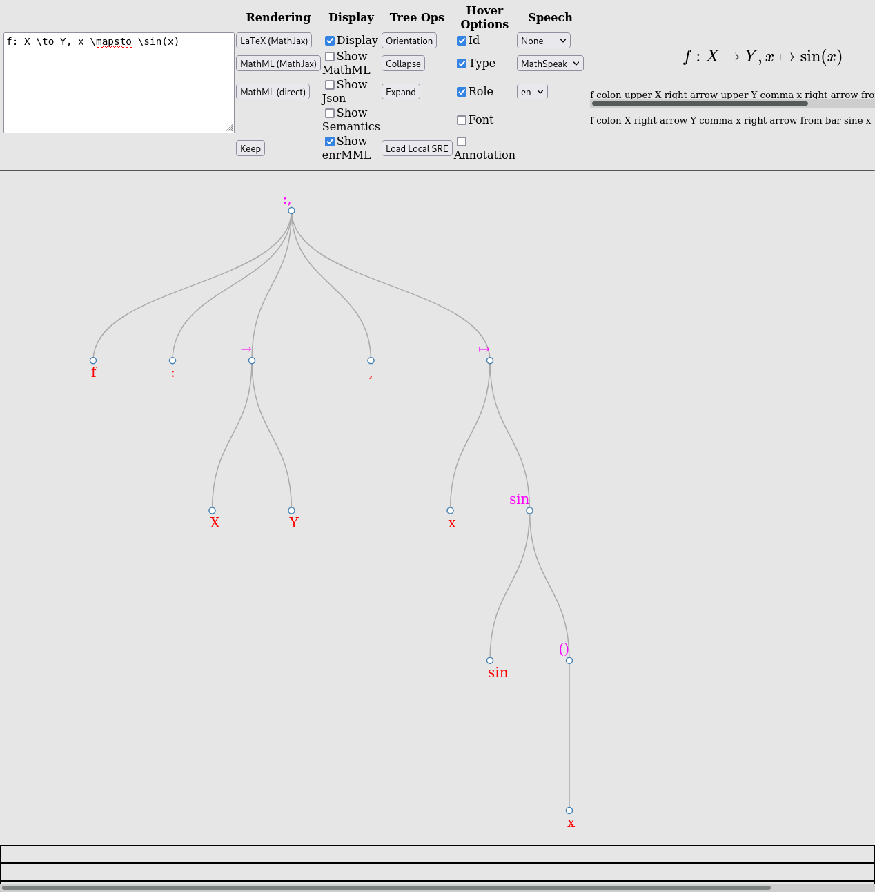

# Enhancing server-side MathJax rendering with common ARIA patterns to provide robust, richly accessible equation layout at scale

*ATHEN STEM Accessibility Conference*

By Peter Krautzberger, [krautzource](https://krautzource.com)

Scroll left/right to move through slides. Click headings to anchor the slide. {style="margin-top: 10%; font-size: 0.8em"}

## Overview

1. [Introduction](#introduction)
2. [Restraints](#restraints)

## 1. Introduction {#introduction}

## Hi

* Former mathematician
* Former Manager at the [MathJax](https://www.mathjax.org) Consortium
* [Independent developer and consultant](https://krautzource.com/)
  focus on STEM publishing conversion pipelines
* [Invited Expert at W3C](https://www.w3.org/participate/invited-experts/)
  co-editor of [the ARIA Specification](https://w3c.github.io/aria/)

## What's this about?

Let's start with some demos.

## What are we looking at?

The [AMS](https://www.ams.org) ebook and [journals](https://www.ams.org/publications/journals/journalsframework/AMSMathViewer) HTML production.

In particular: [Disproof of a conjecture by Rademacher on partial fractions](https://www.ams.org/journals/bproc/2014-01-11/S2330-1511-2014-00014-6/viewer/)
## NVDA

NVDA using Chrome

<video controls style="width:auto; max-height:33vh">
<source src="./nvda_bproc14_chrome.mp4" type="video/mp4">
Sorry, your browser doesn't support embedded videos.
</video>

(Firefox and Edge work, too.)

<my-notes hidden>
* vanilla NVDA in Windows 10 VM
* me following a typical screenreader navigation
* jump by heading
* then browse mode in section
* some inline expressions are read along
* then a block expression shows up (and NVDA focus bug)
* we listen to it but it's long so we explore
* exploration
* moving back into browse mode for the next paragraph
* for good measure, explore some inline content
</my-notes>

## JAWS

JAWS using Chrome

<video controls style="width:auto; max-height:33vh">
<source src="./jaws_bproc14_chrome.mp4" type="video/mp4">
Sorry, your browser doesn't support embedded videos.
</video>

Firefox and Edge work, too.

## VoiceOver Mac OS

VoiceOver using Safari 

<video controls style="width:auto; max-height:33vh">
<source src="./vo-bproc14-safari.mp4" type="video/mp4">
Sorry, your browser doesn't support embedded videos.
</video>

Chrome works, too (better even).

## Orca

Orca using Firefox (with Braille monitor)

<video controls style="width:auto; max-height:33vh">
<source src="./orca_bproc14_firefox.mp4" type="video/mp4">
Sorry, your browser doesn't support embedded videos.
</video>

Chrome works, too.

## VoiceOver iOS

Touch AT is tricky. But we at least get something:

<video controls style="width:auto; max-height:33vh">
<source src="./vo_bproc14_ios.mp4" type="video/mp4">
Sorry, your browser doesn't support embedded videos.
</video>

## Talkback Android

Touch AT is tricky. But we at least get something:

<video controls style="width:auto; max-height:33vh">
<source src="./talkback_bproc14_chrome.mp4" type="video/mp4">
Sorry, your browser doesn't support embedded videos.
</video>

Firefox works, too.

## NVDA in Thorium

NVDA using Thorium

<video controls style="width:auto; max-height:33vh">
<source src="./thorium_bproc14_nvda.mp4" type="video/mp4">
Sorry, your browser doesn't support embedded videos.
</video>

Note: needs extra key (e.g., <kbd>ctrl</kbd>) to prevent Thorium pagination.

## Thorium read-aloud

Thorium using its built-in read-aloud functionality.

<video controls style="width:auto; max-height:33vh">
<source src="./thorium_bproc14_readaloud.mp4" type="video/mp4">
Sorry, your browser doesn't support embedded videos.
</video>

Firefox works, too.

## What have we seen

Print equation layout that 

* voices everywhere & consistently
  * both screenreaders and read-aloud
* provides keyboard exploration
  * following standard tree patterns
* synchronous highlighting (both CSS and AT driven)
* can provide simultaneous (alternative) braille

## What? how? why?

What? [AMS](https://www.ams.org) HTML production but MathJax content in general

How? [github.com/krautzource/aria-tree-walker](https://github.com/krautzource/aria-tree-walker)

Why? [Jakob's Law](https://lawsofux.com/jakobs-law/)

> Users spend most of their time on other sites. This means that users prefer your site to work the same way as all the other sites they already know.

## 2. "Print equation layout" {#printeq}

## AMS = print

## "Print equation layout" - a framing device

[From Wikipedia](https://en.wikipedia.org/wiki/Framing_(social_sciences)):

> [...] framing comprises a set of concepts and theoretical perspectives on how individuals, groups, and societies organize, perceive, and communicate about reality. 

Examples of "print equation layout":

* math mode TeX/LaTeX
* asciimath, groff/eqn
* MathML, OMML
* Mathematica traditionalForm, Maple 1-D/2-D Math

("Typical output" - you can frequently draw anything with these notations.)

<my-notes hidden>

What I call "print equation layout" most people just call "math layout", "formula layout", or just "math" (that last one is somewhat insulting, speaking as a former mathematician). 

This may seem unnnecessary and convoluted. To some degree, I agree. 

For example, I personally don't believe we have seen "web equation layout" come into existence during these first 30 years of the web.

But as a framing device it serves to ground the conversation and keep aspects in focus that I find critical to the discussion. 
</my-notes>

## What's the problem (1)

Print equation layout is ... 

* an elaborate, two-dimensional form of abbreviated notation for highly complex, context dependent abstract thought.
  * even at an elementary level (e.g., long division).
* highly ambiguous (examples: [whystartat.xyz](https://whystartat.xyz/wiki/Category:Ambiguities))
* often integrated into additional complex notation (e.g., text annotation, graphical documents).
* "non-text content" (so [WCAG 1.1.1](https://w3c.github.io/wcag/21/guidelines/#non-text-content) applies).

<my-notes hidden>
* 2d abbreviation: just because it uses text glyphs does not make it text (cf. ascii art).
* non-text: 
  * TeX text vs math mode, or "formula blocks" in MS Word et al).
* e.g., spacing used to infer semantics
* e.g., invisible/implied characters
</my-notes>

## What's the problem (2)

Print equation layout ... 

* has (print) accessibility traditions 
  * tactile and aural traditions (e.g. Nemeth Braille / MathSpeak)
  * many regional variations (cf. [D. Archambault](https://chezdom.net/mathematicalbraillecodes/))
  * require human intervention
* is incompatible with contemporary web accessibility
  * is layout, not semantics
    * so we fall back to print accessibility traditions
  * print accessibility traditions are also about layout
    * limited; modalities are incongruent
  * require heuristics for (non-visual) rendering
  * incongruent to core concepts, e.g., [Accessible Name Computation](https://w3c.github.io/accname/)

<my-notes hidden>

not accessible - cf. WCAG, accname

Print equation layout has its own accessibility traditions (e.g. Nemeth Braille and MathSpeak) which create a set of orthogonal expectations that is difficult to address on the web.

Print equation accessibility traditions (e.g., Nemeth Braille and MathSpeak) exacerbate the problem:

On the one hand, these traditions reduce expectations to the limitations of print technology (e.g., semantics are largely out of scope) [cf svg house made of triangle, rectangle, circle]
On the other hand, these traditions rely on human intervention (through narration or specialized Braille transcribers) which leads to them being underspecified and easily malleable by the assisting person.

</my-notes>

## What's the problem (3)

But what's _really_ the problem?

**Heuristics**

Imagine they fail you. 

* a superscript 2 is voiced squared but isn't
* your layout is interpreted as fraction but it's not. [Legendre_symbol]

How do you fix that?

> Now you have 2 problems

<my-notes hidden>
* heuristics are strongly avoided in web a11y (except to fix broken things)
* if you try to fix something, you now have to work around heuristics as well
  * unspecified heuristics
</my-notes>
 
## On principle

It's print equation layout.

Someone must apply heuristics.

Who?

> Web standards principle: Users before authors, authors before vendors.

Applying heuristics should be a burden on the **author** not the user.

<my-notes hidden>

</my-notes>

## The big tools

[MathJax](https://www.mathjax.org/) the leading visual rendering technology for print equation layout on the web

[Speech Rule Engine](https://speechruleengine.org/) the leading non-visual rendering technology for print equation layout

<my-notes hidden>
</my-notes>

## What if the big tools aren't around?

MathJax's integration of Speech Rule Engine brings the highest quality of visual and non-visual rendering with a trove of features and affordances.

But JavaScript is not always an option - either due to availability or performance.

<my-notes hidden>
</my-notes>

## Real life

From [The Mobile Performance Inequality Gap, 2021](https://infrequently.org/2021/03/the-performance-inequality-gap/)

> 2020’s high-end Androids sport the single-core performance of an iPhone 8, a phone released in Q3’17  
> Mid-priced Androids were slightly faster than 2014’s iPhone 6  
> Low-end Androids have finally caught up to the iPhone 5 from 2012

## Real life at scale (1)

An real life example of scale

[Existence of minimal models for varieties of log general type, Birkar et al.](https://www.ams.org/journals/jams/2010-23-02/S0894-0347-09-00649-3/)

* 64 pages (slighly above average)
* ~5000 equations (in PDF)
* ~6400 equations (in HTML)

<my-notes hidden>
jams649
</my-notes>

## Real life at scale (2)
TODO 

The AMS publishes roughly XXX pages across XXX journal articles and XXX Books each year.

A solution must scale to process this not just once but on each iteration of the product.

## History of this work

* 2018: AIM Workshop [ Web accessibility of mathematics ](https://aimath.org/workshops/upcoming/webmath/)
* 2019 & 2020: Initial demo expanded as [mathjax-sre-walker](https://github.com/krautzource/mathjax-sre-walker/)
  * moving "closer to the metal"
  * evaluating different ARIA solutions for best results
  * [Speech-Rule-Engine](https://github.com/zorkow/speech-rule-engine/) adds new APIs to expose its enrichment
  * [MathJax](https://www.mathjax.org/) releases version 3 with necessary markup improvements
* 2020 - today: Continued as a general purpose [ARIA Tree Walker](https://github.com/krautzource/aria-tree-walker)

<my-notes hidden>
</my-notes>

## SSR to the rescue

Server Side Rendering allows for performant pages at this scale.

[MathJax demos for NodeJS](https://github.com/mathjax/MathJax-demos-node/) offers a range of example code snippets, even for [speech output](https://github.com/mathjax/MathJax-demos-node/tree/master/speech).

☑ performance at scale  
☑ heuristics "move left"

But: how do we get MathJax+SRE client-side accessibility benefits?
## ARIA to the rescue

[The ARIA specification](https://w3c.github.io/aria/) offers many patterns for complex interation beyond the scope of HTML.

Most interaction patterns are derived from OS-level widgets and application interface to follow [Jakob's Law](https://lawsofux.com/jakobs-law/).

Which one do we choose?

## A look inside Speech Rule Engine

Speech Rule Engine offers a visualizer to inspect its heuristic analysis, creating its "semantic tree".

[A simple example](https://speech-rule-engine.github.io/semantic-tree-visualiser/visualise.html?110001111100f%3A%20X%20%5Cto%20Y%2C%20x%20%5Cmapsto%20%5Csin%28x%29)

## ARIA tree pattern

[ARIA's tree role](https://w3c.github.io/aria/#tree)

> A widget that allows the user to select one or more items from a hierarchically organized collection.

[ARIA Authoring Practices Tree Pattern](https://w3c.github.io/aria-practices/#TreeView)

> A tree view widget presents a hierarchical list. Any item in the hierarchy may have child items, and items that have children may be expanded or collapsed to show or hide the children. 

## AT affordances for ARIA trees

* good browse mode support
* enter + esc for quickly switching in and out of focus mode
* customizable level information (level, setsize, posinset)
* easy future enhancements (e.g., braille labels)

## The tiny tools

* In MathJax SSR setup, configure SRE to add structural markup
* [github.com/krautzource/sre-to-tree](https://github.com/krautzource/sre-to-tree), a small NodeJS module for post-processing MathJax+SRE output into ARIA tree markup.
* [github.com/krautzource/aria-tree-walker](https://github.com/krautzource/aria-tree-walker), a tiny JavaScript module to enable a basic exploration for this kind of ARIA tree markup

**Caveat Emptor** Think of these more as examples ([inspiration](https://notes.baldurbjarnason.com/2021/05/03/idle-thought-most.html)). Don't force your content to work with them -- adjust them to work for your content.

<my-notes hidden>
</my-notes>

## User testing 
TODO
Some quotes from users:

....

## Quirks, bugs and future improvements

* inline trees are iffy
* VoiceOver is iffy
* touch support is very hard
* better noops
* better 

## To infinity and beyond

TODO tree walker for more than equations

## Original design ideas

* author responsibility through author ability
* an eye on moving standards
* server-side rendering both visually and non-visually
  * limitation: no user-facing options
  * no heuristics affecting users
  * **fixable** heuristics
  * **fixable** bugs
* progressive enhancement // good fallback behavior
  * static accessible name; lengthy but there
* minimal performance impact
  * DEMO long article
* simple author styling
* enable additional services
  * DEMO: subtitles, speech synthesis
* standards-oriented
  * start with existing standards
  * inform standards development
  * promote multi-purpose standards
  * adjust to emerging improvements
  * promote universally useful standards

<my-notes hidden>
</my-notes>

## Why

* print equation layout
* MathML is not usable
  * support is poor and inconsistent
    * browsers
    * AT
      * VO, JAWS support limited
      * read-aloud no support
      * liblouis poor and now unmaintained Nemeth output
  * MathML is a flawed technology
* 
* 
